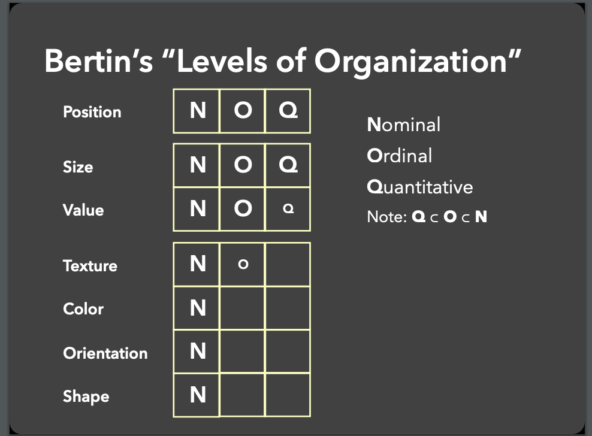
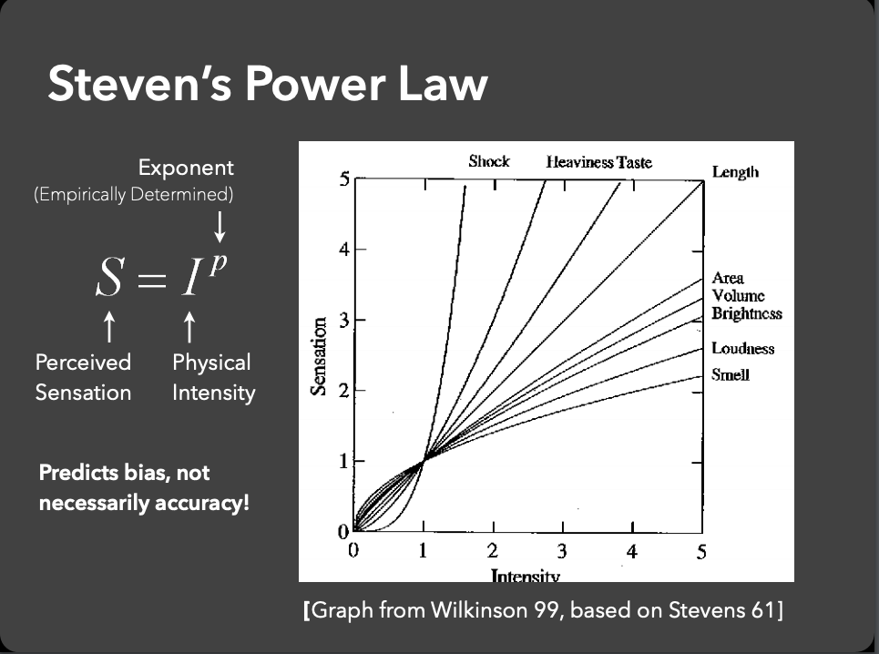

---
title: Data Visualization
author: second presentation
date: 2019-06-04
...

# [CSE512: Data Visualization](https://courses.cs.washington.edu/courses/cse512/19sp/)

[Jeffrey Heer](https://homes.cs.washington.edu/~jheer/)

> The world is awash with increasing amounts of data, and we must keep afloat with our relatively constant perceptual and cognitive abilities. Visualization provides one means of combating information overload, as a **well-designed visual encoding can supplant cognitive calculations with simpler perceptual inferences and improve comprehension, memory, and decision making**. Furthermore, visual representations may help engage more diverse audiences in the process of analytic thinking.

# Big picture: visualization as extended memory{data-background-color="#9fc5e8"}

# Formalizing what we know

{width=700px}

# Adding theory
{width=700px}

# actually think about humans?
{width=700px}

# [fun exercises w/ perception](color.pdf) {data-background-color="#f9cb9c"}

# interactive plots {data-background-color="#9fc5e8"}

# final project!!!!{data-background-color="#f9cb9c"}
